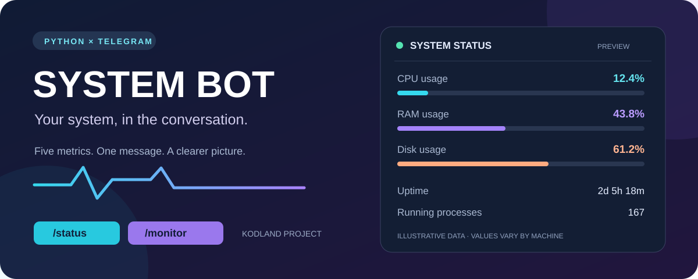

<div align="center">



# 🖥️ System Bot

### Your computer's status, one Telegram message away.


A Python bot that checks system health and sends readable reports straight to a Telegram chat. Built for my Kodland programming course.

</div>

## ✨ What it does

- **Check on demand:** send `/status` for a fresh report.
- **Follow automatically:** send `/monitor` for an immediate report and updates approximately every 60 seconds.
- **Stop whenever you like:** use `/stop` to unsubscribe the current chat.
- **Go beyond the basics:** track uptime and running processes alongside CPU, RAM, and disk usage.

| Parameter | What you learn |
| --- | --- |
| ⚡ CPU | Current processor usage, sampled over one second |
| 🧠 RAM | Memory usage percentage and available memory |
| 💾 Disk | Usage and free space on the drive containing the working directory |
| ⏱️ Uptime | Time since the system last started |
| ⚙️ Processes | Number of running processes |

## 💬 Example report

Illustrative values; your readings will depend on the machine running the bot.

```text
SYSTEM STATUS

CPU usage: 12.4%
RAM usage: 43.8%
Available RAM: 8.99 GiB
Disk usage: 61.2%
Free disk space: 180.70 GiB
Uptime: 2 days, 5 hours, 18 minutes
Running processes: 167
```

## 🚀 Get started

Use Python **3.11** (including Python 3.11.7) and an internet connection.

### 1. Download the project

```bash
git clone https://github.com/DanielFot/System_bot.git
cd System_bot
```

You can also choose **Code → Download ZIP** on GitHub and open the extracted folder in PyCharm.

### 2. Install the libraries

Run this in your terminal or PyCharm's terminal, using the same Python interpreter that runs the bot:

```bash
python -m pip install -r requirements.txt
```

### 3. Set your Telegram token

Open [@BotFather](https://t.me/BotFather) in Telegram, send `/newbot`, and follow the instructions. In your **local copy** of `bot.py`, replace:

```python
TOKEN = "PASTE_YOUR_BOT_TOKEN_HERE"
```

with your bot token. Keep the token private and restore the placeholder before committing or sharing the file.

### 4. Start the bot

```bash
python bot.py
```

Open your bot in Telegram and send `/start`, then `/status` or `/monitor`. Keep the Python program running to receive reports. Press **Ctrl+C** in the terminal to end it.

## 🎮 Commands

| Command | Action |
| --- | --- |
| `/start` or `/help` | Show available commands |
| `/status` | Send the latest system report |
| `/monitor` | Enable automatic reports for this chat |
| `/stop` | Disable automatic reports for this chat |

## 🛠️ How it works

`psutil` reads system measurements. `pyTelegramBotAPI` receives commands and sends messages. A background thread handles automatic reports while the bot continues listening for commands.

The code separates the work into named functions: `get_system_report()`, `automatic_reports()`, `main()`, and individual command handlers.

```text
System_bot/
├── bot.py                 # Bot and monitoring functions
├── requirements.txt       # Python libraries
├── assets/
│   └── system-bot.svg     # Project banner and illustrative preview
└── README.md              # Project guide
```

## 📌 Good to know

- The bot measures the **machine running Python**. On the Kodland platform, that means its execution environment; in PyCharm, it means your own computer.
- Subscriptions are stored in memory. Send `/monitor` again after restarting the program.
- This classroom version responds to anyone who can message the bot; it has no owner-only access restriction.
- A report already being sent may arrive just after `/stop`.
- Local checks covered real system data collection and command handlers with simulated Telegram sending. Live delivery needs a valid bot token and has not been verified as part of these checks.

## 🌱 What I practiced

Python functions, Telegram commands, system monitoring, background threads, shared-state locking, and handling report failures.

---

**Built by [DanielFot](https://github.com/DanielFot) for Kodland.** Small project, useful insights. 🚀
